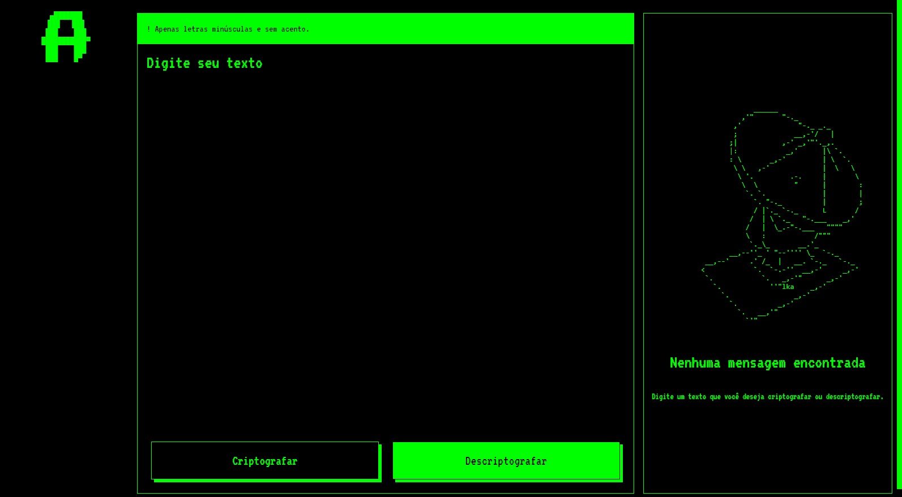

# Decodificador de Texto
## Descrição

O **Decodificador de Texto** é uma aplicação web simples que permite aos usuários criptografar e descriptografar texto usando uma cifra básica. O projeto utiliza HTML, CSS e JavaScript para fornecer uma interface de usuário interativa e responsiva.

